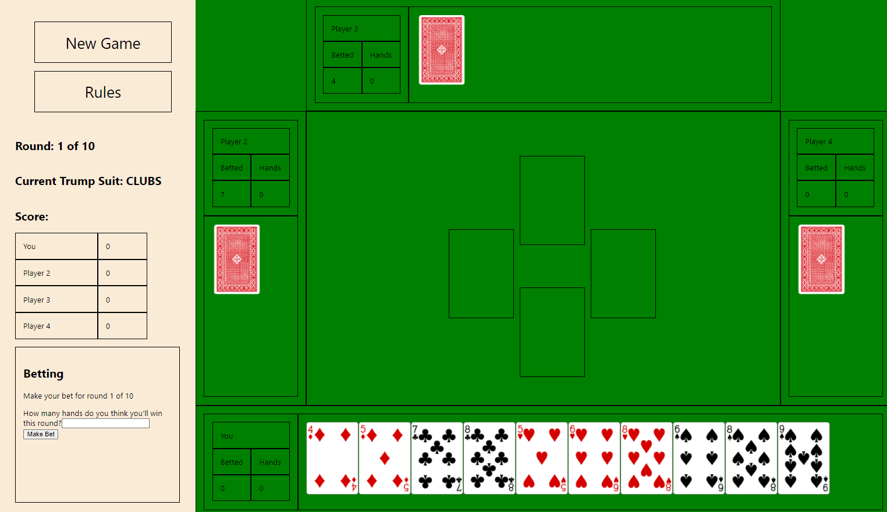

# Card Game built with React (Build Week)

This project was bootstrapped with [Create React App](https://github.com/facebook/create-react-app).

I have built a card game using react. The game I built follows the set of rules I used to play, but the rules of a similar game can be found at the following link:
https://www.pagat.com/exact/ohhell.html. The rules of my game can be found in the Rules component as well. 

## User Interaction

Player is dealt cards when clicking New Game or per round. 
Player can play a card by clicking on it per “hand”. 
Player can make a bet each round.
Player can see rules of game.
Player can play 10 rounds.
Player can see scores. 

## MVP

Player can play a game of 10 rounds with no glitches and correct scoring. Animations not necessary for MVP but ideal if time.

## Design

